# REFERENCE DESIGN IMPLEMENTATION PLAN
## Dogfood 2026 — Visual Transformation & System Architecture

**Document Version:** 1.0.0  
**Status:** Architecture Complete / Ready for Review  
**Primary Design Source of Truth:** `Dogfood_Design_Reference.md` (derived from high-resolution recording `website (1).mp4`)  
**Primary Functionality Source of Truth:** Existing Dogfood Repository (`backend/`, `frontend/`, `prisma/`, `tests/`)

---

## 1. Executive Summary & Design Reference Breakdown

The **Dogfood Design Reference** establishes a cinematic, sophisticated, dark creative-tech landing and platform experience:

### Visual Language & Atmosphere
- **Canvas & Environment**: Near-black base (`#070609` / `#09080d`) illuminated by deep violet and indigo atmospheric glow (`#1e1435` / `#39226d` / `#7a4ee0`). The illumination feels cast by the central living digital object rather than a generic linear gradient.
- **Visual Centerpiece**: A large, fluid, organic 3D-like sculptural core occupying the lower half of the hero. It has dark obsidian surfaces, smooth shifting contours, and soft violet/purple rim highlights that continuously breathe, ripple, and deform in slow, organic motion.
- **Typography & Structure**: Large centered display headline (clean modern sans-serif, tight line-height, off-white `#f5f4f8`), supported by a compact, narrow 1–2 line muted description (`#9a98a6`), and a high-contrast white/off-white pill CTA (`#ffffff` with dark text `#0d0b14`).
- **Floating HUD Markers**: Two compact, dark, softly rounded translucent HUD cards anchored visually around the central form (Left: Project metrics `PROJECTS // 128 SHIPPED`; Right: Judging progress `JUDGING // 96% COMPLETE`).
- **Interaction & Parallax**: Multi-layered, subtle mouse-driven spring-lerp parallax (atmosphere stationary, main core shifting subtly, HUD cards moving with slight elevation, cards illuminating delicately on hover).
- **Navigation**: Minimal, lightweight top bar (`DOGFOOD`, `Hackathons`, `Projects`, `Judging`, `Results`, `Login`, `Enter Hackathon`) without heavy sidebars on the public experience.

---

## 2. Current Dogfood UI Audit

| Dimension | Current Implementation | Reference Requirement | Transformation Delta |
| :--- | :--- | :--- | :--- |
| **Hero Centerpiece** | 2D technical drafting rings, conduit lines, and green signal pulse (`KineticHero.jsx`) | Organic, fluid 3D-like sculptural core with violet rim lighting | Replace 2D schematic wireframe with smooth organic deforming canvas/SVG core |
| **Atmospheric Glow** | Flat near-black (`#090909`) with sharp border boxes | Deep violet/indigo environmental illumination and subtle depth field | Implement layered radial depth glows and soft rim luminescence |
| **Headline & CTA** | Monospace technical headers with lavender rectangular buttons (`#bca1ee`) | Bold clean sans-serif display typography with compact pill CTA (`rounded-full bg-white`) | Upgrade typography tokens, tight tracking/line-height, and pill CTA styling |
| **Information Cards** | Linear border metric boxes | Dark translucent floating HUD cards with micro-progress and status indicators | Convert to floating, softly-blurred HUD capsules with subtle parallax offsets |
| **Navigation** | Sticky technical bar with heavy monospace tabs | Minimal, lightweight editorial header with subtle transitions and pill action | Refine navigation into lightweight, unobtrusive brand + tabs + compact pill trigger |
| **Functional Views (Gallery, Judging, etc.)** | Flat monospace table/card grid | Cohesive dark-violet editorial panels, micro-badges, and clean elevation | Re-skin all views with shared design tokens while preserving 100% workflows |

---

## 3. Current Project Progress & Authoritative Status

The Dogfood platform is **48.8% functionally complete** (21 of 43 phases completed & verified with 189 passing backend tests across 20 test suites).

### Completed & Authoritative Functional Scope (Phases 0 to 20):
1. **Tier 1 (Phases 0–9)**: Local DB, Auth, RBAC, Monorepo, Design System, Event Engine, Team Formation & Invites, Project Submissions, Gallery, Real-time Countdown.
2. **Tier 2 (Phases 10–16)**: Judge Assignment Matrix, Rubric Evaluation, Z-Score Normalization, Dynamic Leaderboard, Community Voting, Winner Showcase, Audit Logs.
3. **Tier 3 (Phases 17–20)**: Threaded Discussions, Hacker Directory Matchmaking, Activity Feed & SSE In-App Notifications, Organizer Broadcasts & Banner Takeovers.

### Genuinely Remaining Functional Phases (Phases 21 to 42):
- **Tier 3 (Finish)**: Phase 21 (Reputation & Trust Graph), Phase 22 (Mentors), Phase 23 (Workshops), Phase 24 (Q&A Knowledge Base).
- **Tier 4 (Enterprise & IoT)**: Phase 25 (RBAC Explorer), Phase 26 (Multi-Tenant), Phase 27 (Hardware Lab), Phase 28 (Code Similarity), Phase 29 (Mesh Sync), Phase 30 (Passkeys/MFA).
- **Tier 5 (Analytics & Exports)**: Phase 31 (Analytics), Phase 32 (Certificates), Phase 33 (Sponsors), Phase 34 (Data Export), Phase 35 (Offline PWA), Phase 36 (Telemetry).
- **Tier 6 (Hardening & Delivery)**: Phase 37 (E2E Tests), Phase 38 (Stress Benchmark), Phase 39 (Security Audit), Phase 40 (a11y), Phase 41 (Docker Bundle), Phase 42 (Final Gate).

---

## 4. Design System Mapping (Design Reference Tokens)

### 4.1 Color Palette
```css
:root {
  /* Canvas & Environmental Backgrounds */
  --bg-deep: #070609;
  --bg-surface: #0c0b11;
  --bg-surface-elevated: #13111b;
  --bg-overlay: rgba(12, 11, 17, 0.85);

  /* Violet & Indigo Atmosphere */
  --violet-glow-core: #7a4ee0;
  --violet-glow-ambient: #351c68;
  --violet-edge-highlight: #bfa5ff;
  --violet-faint: rgba(122, 78, 224, 0.12);
  --violet-border: rgba(142, 100, 245, 0.25);

  /* Typography & Foreground */
  --text-primary: #f5f4f8;
  --text-secondary: #c5c3d0;
  --text-muted: #8b8899;
  --text-dim: #5c596b;

  /* Pill CTAs & Highlights */
  --pill-bg: #ffffff;
  --pill-text: #0b0a10;
  --pill-hover: #ece9f5;
  --signal-green: #9eea9a;
  --signal-red: #ff6b6b;

  /* Subtle Borders & Dividers */
  --border-subtle: rgba(255, 255, 255, 0.07);
  --border-highlight: rgba(191, 165, 255, 0.22);
}
```

### 4.2 Typography Hierarchy
- **Display Hero Headline**: `font-sans font-semibold tracking-tight text-4xl sm:text-6xl md:text-7xl leading-[0.98] text-[#f5f4f8]`
- **Hero Supporting Text**: `font-sans text-xs sm:text-sm text-[#9a98a6] max-w-md text-center leading-relaxed`
- **Pill CTA**: `font-sans text-xs font-semibold px-6 py-2.5 rounded-full bg-white text-[#0b0a10] tracking-wide shadow-lg hover:bg-[#ece9f5] transition-all`
- **HUD Micro-Labels**: `font-mono text-[9px] uppercase tracking-widest text-[#8b8899]`
- **HUD Big Metrics**: `font-sans font-bold text-lg sm:text-xl text-[#f5f4f8]`
- **Body & Data**: Clean, crisp typography with monospace accents for code, hashes, timestamps, and live telemetry.

---

## 5. Component Architecture & Mapping

```
frontend/src/
├── components/
│   ├── hero/
│   │   ├── FluidLivingCore.jsx       <-- NEW: Continuous organic deforming 3D-like core with violet rim lighting
│   │   ├── FloatingHudCard.jsx       <-- NEW: Translucent floating HUD capsule (metrics, status, lerp parallax)
│   │   └── ReferenceHero.jsx         <-- NEW: Full composition matching Reference (Headline, Pill CTA, Living Core, HUD)
│   ├── layout/
│   │   ├── MinimalNav.jsx            <-- NEW: Clean top navigation with lightweight links & pill action
│   │   ├── ActiveBannerTakeover.jsx  <-- RE-STYLED: Critical alert banner in dark violet/red aesthetic
│   │   └── NotificationDrawer.jsx    <-- RE-STYLED: Translucent sliding drawer for in-app SSE alerts
│   ├── ui/
│   │   ├── PillButton.jsx            <-- NEW: Reusable pill CTA & action buttons
│   │   ├── AmbientCard.jsx           <-- NEW: Dark softly-bordered surface with ambient violet hover
│   │   ├── MetricCapsule.jsx         <-- NEW: Compact HUD badge for live metrics
│   │   └── StatusBadge.jsx           <-- RE-STYLED: Micro-pills for tracks, roles, priorities
│   └── modals/
│       ├── AuthModal.jsx             <-- RE-STYLED: Centered modal in reference aesthetic
│       ├── SubmitProjectModal.jsx    <-- RE-STYLED: Clean multi-step project submission form
│       └── EndorseModal.jsx          <-- RE-STYLED: Peer skill endorsement dialog
```

---

## 6. Page & Experience Mapping

| Experience | Visual Treatment in Reference Design | Functional Preservations |
| :--- | :--- | :--- |
| **Landing / Overview** | Full Reference Hero with Fluid Living Core, Centered Headline, Pill CTA, Floating HUD Cards, and Live Platform Feed | Live event timer, prize summary, recent winners, SSE activity stream |
| **Project Gallery** | Ambient dark cards with subtle violet hover borders, clean tags, search/filter bar, and modal/drawer inspection | Multi-track filter, search query, live community voting trigger, project details |
| **Leaderboard** | High-contrast editorial rank table with subtle gradient rank indicators, mode switcher (Normalized/Raw/Community), and track pills | Z-Score normalization display, privacy locks, zero data leakage |
| **Judging Console** | Clean, distraction-free scoring workspace with slider/numeric inputs, assignment queue pills, and save feedback | Rubric criteria weights, score validation, judge isolation, audit logging |
| **Broadcasts & Alerts** | Integrated organizer broadcast composer with priority selector, target audience pills, and 1-click banner takeover | SSE broadcast stream, audience filtering, active banner takeover mutex |
| **Hacker Directory & Matchmaking** | Crisp builder cards with skill tags, portfolio links, team recruiting status, and 1-click application | Skill search, apply-to-team modal, peer trust graph endorsements |

---

## 7. Animation & Motion Architecture

1. **Fluid Living Core Animation**:
   - Implemented via a lightweight 60 FPS HTML5 `<canvas>` / procedural SVG mesh with multi-frequency simplex noise and cubic bezier spline interpolation.
   - Smooth, continuous deformation with violet contour shaders and soft rim luminescence.
   - Zero external WebGL bloat; 100% self-contained, GPU-accelerated, offline-capable, and pauses when offscreen (`IntersectionObserver`).
2. **Spring-Lerped Mouse Parallax**:
   - Multi-layer depth factor: Background atmosphere (0.02x), Living Core (0.05x), Left HUD Card (0.12x), Right HUD Card (0.16x).
   - Smooth damping with linear interpolation (`lerp = 0.05`).
3. **Reduced Motion Compliance**:
   - When `@media (prefers-reduced-motion: reduce)` is active, deformation and parallax automatically collapse into a static, elegant violet luminous silhouette.

---

## 8. Safe Phased Implementation Order (Phases A through S)

```mermaid
flowchart TD
    A["PHASE A: Global Design Tokens (index.css & Tailwind)"] --> B["PHASE B: Typography & Font Scaling"]
    B --> C["PHASE C: Background & Atmospheric Surfaces"]
    C --> D["PHASE D: Minimal Navigation & Top Header"]
    D --> E["PHASE E: Reusable UI (PillButton, AmbientCard, HUD Capsules)"]
    E --> F["PHASE F: Global Motion & Spring-Lerp Parallax Engine"]
    F --> G["PHASE G: Landing Hero & Fluid Living Core"]
    G --> H["PHASE H: Public Event & Overview Section"]
    H --> I["PHASE I: Project Gallery & Filter Controls"]
    I --> J["PHASE J: Project Detail & Discussion Threading"]
    J --> K["PHASE K: Participant Dashboard & Team Matchmaking"]
    K --> L["PHASE L: Project Submission Workflow"]
    L --> M["PHASE M: Judge Scoring & Evaluation Console"]
    M --> N["PHASE N: Organizer Control Room & Broadcasts"]
    N --> O["PHASE O: Dynamic Leaderboard & Winner Showcase"]
    O --> P["PHASE P: Responsive Mobile/Tablet Refinement"]
    P --> Q["PHASE Q: Accessibility & Reduced Motion Auditing"]
    Q --> R["PHASE R: Offline & 60 FPS Performance Profiling"]
    R --> S["PHASE S: Full Regression Testing & Test Suite Verification"]
    S --> Next["Resume Functional Phase 21 (Reputation & Badging)"]
```



---

## 9. Preserved vs Redesigned Components

### 🛡️ Strictly Preserved (Zero Loss of Logic):
- All backend controllers (`authController.js`, `eventController.js`, `submissionController.js`, `judgeController.js`, `votingController.js`, `announcementController.js`, `notificationController.js`, `teamController.js`).
- All Prisma database schemas, migrations, relations, and seed scripts.
- All JWT authentication, RBAC authorization, and password hashing logic.
- All real-time SSE endpoints (`/api/notifications/stream`, `/api/activity/stream`).
- All 20 existing test suites (`backend/tests/**/*.test.js`).

### 🎨 Visually Redesigned & Re-Styled:
- `frontend/src/index.css`: Replaced with new reference tokens (dark violet atmosphere, pill buttons, HUD cards).
- `frontend/src/components/KineticHero.jsx` ➔ Replaced by `ReferenceHero.jsx` + `FluidLivingCore.jsx` + `FloatingHudCard.jsx`.
- `frontend/src/App.jsx`: Cleanly modularized and styled to consume the reference design system for all views while binding to the exact same state, hooks, and API endpoints.

---

## 10. Coexistence with Remaining Functional Phases (Phases 21 to 42)

Once the visual transformation (Phases A through S) is completed and verified against the design reference:
1. All newly authored features for **Phases 21 through 42** will natively build on the new **Reference Design System** (using `AmbientCard`, `PillButton`, `StatusBadge`, and dark-violet elevation).
2. Development resumes immediately with **Phase 21: Dynamic Reputation, Trust Graph & Badging System**.

---

## 11. Verification Checklist for Design Gate

- [x] Primary Design Source of Truth (`Dogfood_Design_Reference.md`) thoroughly audited.
- [x] Primary Functionality Source of Truth (Existing repo, 20 passing test suites) verified.
- [x] Detailed implementation plan and component architecture documented in `/docs/REFERENCE_DESIGN_IMPLEMENTATION.md`.
- [x] Execution halted awaiting user review and explicit approval.
